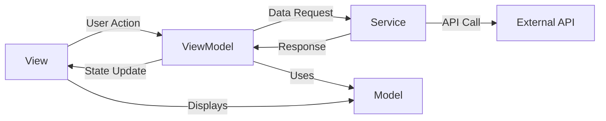

Breeze uses modern Swift and SwiftUI patterns to create a maintainable, scalable, and thread-safe application.

## Core Architectural Patterns

<CardGroup cols={2}>
  <Card title="MVVM" icon="layer-group" iconType="solid">
    Model-View-ViewModel for clear separation of concerns
  </Card>
  <Card title="Actor Pattern" icon="lock" iconType="solid">
    Thread-safe service layer using Swift actors
  </Card>
  <Card title="Declarative UI" icon="code" iconType="solid">
    SwiftUI for reactive, declarative interfaces
  </Card>
  <Card title="Async/Await" icon="bolt" iconType="solid">
    Modern concurrency for clean async code
  </Card>
</CardGroup>

## MVVM Pattern

Breeze implements the Model-View-ViewModel pattern for clear separation between UI and business logic.

### Architecture Flow



### ViewModel Example

The `DashboardViewModel` demonstrates the MVVM pattern:

<CodeGroup>
```swift DashboardViewModel.swift
import Foundation
import SwiftUI
import CoreLocation

/// Main view model for the dashboard
@MainActor
class DashboardViewModel: NSObject, ObservableObject {
    // MARK: - Published Properties
    @Published var airQuality: AirQuality?
    @Published var pollutants: [PollutantReading] = []
    @Published var pollenItems: [PollenItem] = []
    @Published var climateData: [ClimateDataPoint] = []
    @Published var locationName: String = ""
    @Published var isLoading = false
    @Published var errorMessage: String?
    @Published var searchQuery = ""
    @Published var searchResults: [City] = []
    @Published var useFahrenheit = true
    
    // MARK: - Private Properties
    private let locationManager = CLLocationManager()
    private var searchTask: Task<Void, Never>?
    
    // MARK: - Computed Properties
    var aqiStatus: AQIStatus? {
        guard let aqi = airQuality?.usAQI else { return nil }
        return AQIStatus.from(aqi: aqi)
    }
    
    var aqiColor: Color {
        guard let status = aqiStatus else { return .gray }
        switch status.color {
        case "aqiGood": return .aqiGood
        case "aqiModerate": return .aqiModerate
        case "aqiUnhealthy": return .aqiUnhealthy
        default: return .gray
        }
    }
    
    // MARK: - Data Fetching
    func fetchAllData(latitude: Double, longitude: Double) async {
        isLoading = true
        errorMessage = nil
        
        // Fetch air quality
        do {
            let aq = try await AirQualityService.shared.fetchAirQuality(
                latitude: latitude,
                longitude: longitude
            )
            self.airQuality = aq
            
            // Create pollutant readings
            self.pollutants = [
                PollutantReading(type: .pm25, value: aq.pm25),
                PollutantReading(type: .pm10, value: aq.pm10),
                PollutantReading(type: .no2, value: aq.nitrogenDioxide)
            ]
        } catch {
            self.errorMessage = "Unable to fetch air quality data."
        }
        
        isLoading = false
    }
}
```
</CodeGroup>

<Info>
**Key MVVM Characteristics:**
- `@Published` properties for reactive state updates
- `@MainActor` ensures UI updates on main thread
- Business logic separated from UI
- Computed properties for derived state
</Info>

### View Observing ViewModel

<CodeGroup>
```swift DashboardView.swift
import SwiftUI

struct DashboardView: View {
    @ObservedObject var viewModel: DashboardViewModel
    
    var body: some View {
        ScrollView {
            VStack(spacing: 20) {
                // Location Header
                Text(viewModel.locationName)
                    .font(.title)
                    .fontWeight(.semibold)
                
                // AQI Card
                AQICard(viewModel: viewModel)
                
                // Pollutants Grid
                PollutantsGrid(pollutants: viewModel.pollutants)
            }
        }
        .refreshable {
            await viewModel.fetchAllData(latitude: 0, longitude: 0)
        }
    }
}
```
</CodeGroup>

<Tip>
Views observe the ViewModel using `@ObservedObject`. When published properties change, SwiftUI automatically re-renders affected views.
</Tip>

## Actor Pattern for Services

All services use Swift's `actor` pattern for thread-safe API communication.

### Why Actors?

<AccordionGroup>
  <Accordion title="Thread Safety">
    Actors ensure only one task can access mutable state at a time, preventing data races.
  </Accordion>
  
  <Accordion title="Automatic Synchronization">
    Swift automatically manages synchronization - no manual locks or dispatch queues needed.
  </Accordion>
  
  <Accordion title="Compiler Enforcement">
    The compiler enforces safe concurrent access patterns at compile time.
  </Accordion>
</AccordionGroup>

### Service Actor Example

<CodeGroup>
```swift AirQualityService.swift
import Foundation

/// Service for fetching air quality data from Open-Meteo API
actor AirQualityService {
    static let shared = AirQualityService()
    
    private let baseURL = "https://air-quality-api.open-meteo.com/v1/air-quality"
    
    /// Fetch current air quality for a location
    func fetchAirQuality(latitude: Double, longitude: Double) async throws -> AirQuality {
        var components = URLComponents(string: baseURL)!
        components.queryItems = [
            URLQueryItem(name: "latitude", value: String(latitude)),
            URLQueryItem(name: "longitude", value: String(longitude)),
            URLQueryItem(name: "current", value: "us_aqi,pm10,pm2_5,carbon_monoxide,nitrogen_dioxide,sulphur_dioxide,ozone"),
            URLQueryItem(name: "timezone", value: "auto")
        ]
        
        guard let url = components.url else {
            throw URLError(.badURL)
        }
        
        let (data, response) = try await URLSession.shared.data(from: url)
        
        guard let httpResponse = response as? HTTPURLResponse,
              httpResponse.statusCode == 200 else {
            throw URLError(.badServerResponse)
        }
        
        let decoder = JSONDecoder()
        let result = try decoder.decode(AirQualityResponse.self, from: data)
        
        guard let airQuality = result.current else {
            throw NSError(domain: "AirQualityService", code: 1, 
                         userInfo: [NSLocalizedDescriptionKey: "No air quality data available"])
        }
        
        return airQuality
    }
}
```
</CodeGroup>

<Note>
**Actor Benefits:**
- `actor` keyword makes the entire class thread-safe
- Methods are implicitly `async` when called from outside
- Shared singleton pattern (`static let shared`) is safe
- No manual synchronization needed
</Note>

### Calling Actor Methods

Actor methods require `await` when called from outside:

```swift Calling Actors
// From ViewModel (already @MainActor)
let aq = try await AirQualityService.shared.fetchAirQuality(
    latitude: latitude,
    longitude: longitude
)
```

<Warning>
Actor methods can only be called with `await` because the actor may need to synchronize access. This prevents blocking the main thread.
</Warning>

## Async/Await Pattern

Breeze uses Swift's modern concurrency with async/await for clean asynchronous code.

### Parallel vs Sequential Fetching

<CodeGroup>
```swift Parallel Fetching
// Non-blocking parallel tasks
Task {
    do {
        let pollen = try await PollenService.shared.fetchPollen(
            latitude: latitude,
            longitude: longitude
        )
        self.pollenItems = pollen
    } catch {
        print("Pollen error: \(error)")
    }
}

Task {
    do {
        let climate = try await ClimateService.shared.fetchClimateData(
            latitude: latitude,
            longitude: longitude
        )
        self.climateData = climate
    } catch {
        print("Climate error: \(error)")
    }
}
```

```swift Sequential Fetching
// Critical data fetched first, then secondary data
do {
    // Block until air quality is fetched
    let aq = try await AirQualityService.shared.fetchAirQuality(
        latitude: latitude,
        longitude: longitude
    )
    self.airQuality = aq
    
    // Process pollutants from air quality data
    self.pollutants = [
        PollutantReading(type: .pm25, value: aq.pm25),
        PollutantReading(type: .pm10, value: aq.pm10)
    ]
} catch {
    self.errorMessage = "Unable to fetch air quality data."
}
```
</CodeGroup>

<Tip>
**Pattern Choice:**
- Use sequential (`await`) when data depends on previous results
- Use parallel (`Task {}`) for independent data fetching
- Balance between performance and data dependencies
</Tip>

## SwiftUI Declarative Patterns

Breeze embraces SwiftUI's declarative approach for building UIs.

### Property Wrappers

<CodeGroup>
```swift Property Wrappers
// ViewModel
@Published var airQuality: AirQuality?        // Observable state
@Published var isLoading = false              // Loading state

// View
@ObservedObject var viewModel: DashboardViewModel  // Observe ViewModel
@State private var showSettings = false            // Local view state
@AppStorage("useFahrenheit") var useFahrenheit = true  // Persisted preference
```
</CodeGroup>

| Property Wrapper | Purpose | Scope |
|-----------------|---------|-------|
| `@Published` | Observable property in ViewModel | ViewModel |
| `@ObservedObject` | Observe external object | View |
| `@State` | Local view state | Single view |
| `@AppStorage` | UserDefaults backed state | App-wide |
| `@MainActor` | Ensure main thread execution | Class/function |

### Conditional Rendering

<CodeGroup>
```swift Conditional Views
var body: some View {
    VStack {
        if viewModel.isLoading {
            LoadingView()
        } else if let error = viewModel.errorMessage {
            ErrorView(message: error)
        } else if let airQuality = viewModel.airQuality {
            AQICard(airQuality: airQuality)
        } else {
            EmptyStateView()
        }
    }
}
```
</CodeGroup>

### View Composition

Breeze breaks down complex views into smaller components:

```swift View Composition
struct DashboardView: View {
    var body: some View {
        ScrollView {
            VStack(spacing: 20) {
                LocationHeader(name: viewModel.locationName)
                AQICard(viewModel: viewModel)
                PollenView(items: viewModel.pollenItems)
                PollutantsGrid(pollutants: viewModel.pollutants)
                ClimateChartView(data: viewModel.climateData)
            }
        }
    }
}
```

<Info>
Each component is self-contained and reusable, making the code easier to test and maintain.
</Info>

## Model Pattern

Models are simple, immutable data structures conforming to `Codable`.

<CodeGroup>
```swift Model Example
import Foundation

/// Air quality data from Open-Meteo API
struct AirQuality: Codable {
    let usAQI: Int
    let pm25: Double
    let pm10: Double
    let carbonMonoxide: Double
    let nitrogenDioxide: Double
    let sulphurDioxide: Double
    let ozone: Double
    
    enum CodingKeys: String, CodingKey {
        case usAQI = "us_aqi"
        case pm25 = "pm2_5"
        case pm10
        case carbonMonoxide = "carbon_monoxide"
        case nitrogenDioxide = "nitrogen_dioxide"
        case sulphurDioxide = "sulphur_dioxide"
        case ozone
    }
}
```
</CodeGroup>

<AccordionGroup>
  <Accordion title="Why struct over class?">
    - Value semantics (copying instead of referencing)
    - Thread-safe by default
    - No reference counting overhead
    - Perfect for immutable data
  </Accordion>
  
  <Accordion title="Why Codable?">
    - Automatic JSON encoding/decoding
    - Type-safe API responses
    - Custom key mapping with `CodingKeys`
  </Accordion>
</AccordionGroup>

## Pattern Summary

<CardGroup cols={2}>
  <Card title="MVVM" icon="layer-group">
    - ViewModels manage state
    - Views observe and render
    - Models represent data
    - Clear separation of concerns
  </Card>
  
  <Card title="Actor Pattern" icon="lock">
    - Thread-safe services
    - Compiler-enforced safety
    - No manual synchronization
    - Singleton pattern with `static let`
  </Card>
  
  <Card title="Async/Await" icon="bolt">
    - Clean asynchronous code
    - Parallel and sequential fetching
    - Error handling with try/catch
    - Task-based concurrency
  </Card>
  
  <Card title="SwiftUI" icon="code">
    - Declarative UI syntax
    - Reactive data binding
    - View composition
    - State-driven rendering
  </Card>
</CardGroup>

## Best Practices

<Steps>
  <Step title="Keep ViewModels focused">
    One ViewModel per major screen. Extract shared logic into separate services or utilities.
  </Step>
  
  <Step title="Use actors for shared state">
    Any service that manages shared mutable state should be an actor for thread safety.
  </Step>
  
  <Step title="Prefer async/await over callbacks">
    Modern concurrency is clearer and less error-prone than completion handlers.
  </Step>
  
  <Step title="Keep views small">
    Break down complex views into smaller, reusable components.
  </Step>
  
  <Step title="Use @MainActor for ViewModels">
    Ensures all UI updates happen on the main thread automatically.
  </Step>
</Steps>

## Next Steps

<CardGroup cols={2}>
  <Card title="Project Structure" icon="folder-tree" href="/architecture/project-structure">
    Understand the file organization
  </Card>
  <Card title="Services Reference" icon="server" href="/architecture/services">
    Explore service implementations
  </Card>
</CardGroup>